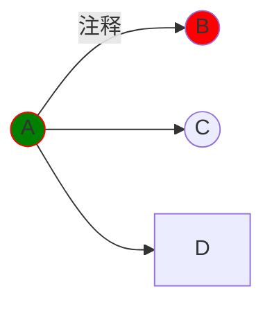
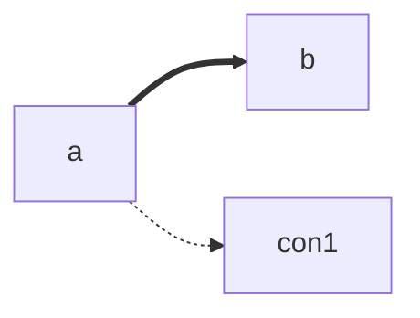

<style>
h1,h3{
    text-align:center
}
</style>

# 教程
latex公式：
$$
 1. k(x)=\int^{123}_{abc}f(x)dx \neq q \\
 2. \frac{\partial x}{\partial_x y} = \sqrt[4]{a\times b+a \cdot c+\div}\\
 3. a \subseteq b,a \supseteq b,a \nsubseteq B,a \in b\\
 4. \int,\emptyset,\lt,\le,\nleq,\perp,\measuredangle,\sphericalangle,\forall,\exists
$$

### 思维导图


```text
1.可以预先声明，如A((A));B((B));
2.每行一个操作，多个操作用英文分号隔开
3.fill 填充色，stroke 外壳
```

### 直接引用HTML代码1
<a>aa</a>   

```text
1.<br>是HTML换行
2.&nbsp;&emsp;都是空格
3.如果显示异常，尝试在中间加个空格
```
<br>

### 直接引用HTML代码2
```html
<!-- --applet-- -->
<p>aa</p>
```
### 思维导图
+ root{.mindmap}
    + root1
        + root2
        + root4
        + root5
            + root6
            + root7
    + root3
### 表格
| 1 | 2 | 3 |
| -- | -- | -- |
| TD {colspan=2}| TD{rowspan=2} |
|1|2|

```js
// --echarts-- 
chart => chart.setOption({
  d:{
      max:100
  },
  xAxis: {
    type: "category",
    data: ["Mon", "Tue", "Wed", "Thu", "Fri", "Sat", "Sun"]
  },
  yAxis: {
    type: "value"
  },
  legend: {
            data:['销量']
        },
  series: [
    {
      name:'销量',
      data: [150, 230, 224, 218, 135, 147, 260],
      type: "bar"
    },
    {
      data: [150, 230, 224, 218, 135, 50, 100],
      type: "line"
    }
  ],
  color:['green', 'red', 'blue']
}, true)

```

```js
// --echarts-- 
chart => chart.setOption({
  max:{
      max:100
  },
  radar: {
    indicator: [
      { name: 'Sales', max: 50000 },
      { name: 'Administration', max: 50000 },
      { name: 'Information Technology', max: 50000 },
      { name: 'Customer Support', max: 50000 },
      { name: 'Development', max: 50000 },
      { name: 'Marketing', max: 50000 }
    ]
  },
  series: [
    {
      type: 'radar',
      data: [
        {
          value: [42000, 9000, 20000, 35000, 50000, 18000],
          name: 'Allocated Budget'
        }
      ]
    }
  ]
}, true)
```

::::: row 
:::: col 
```js
// --echarts-- 
chart => chart.setOption({
  max:{
      max:100
  },
  radar: {
    indicator: [
      { name: 'Sales', max: 50000 },
      { name: 'Administration', max: 50000 },
      { name: 'Information Technology', max: 50000 },
      { name: 'Customer Support', max: 50000 },
      { name: 'Development', max: 50000 },
      { name: 'Marketing', max: 50000 }
    ]
  },
  series: [
    {
      type: 'radar',
      data: [
        {
          value: [42000, 9000, 20000, 35000, 50000, 18000],
          name: 'Allocated Budget'
        }
      ]
    }
  ]
}, true)
```
:::: 
:::: col 
sssss
:::: 
:::::

