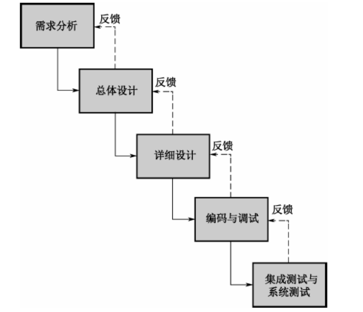
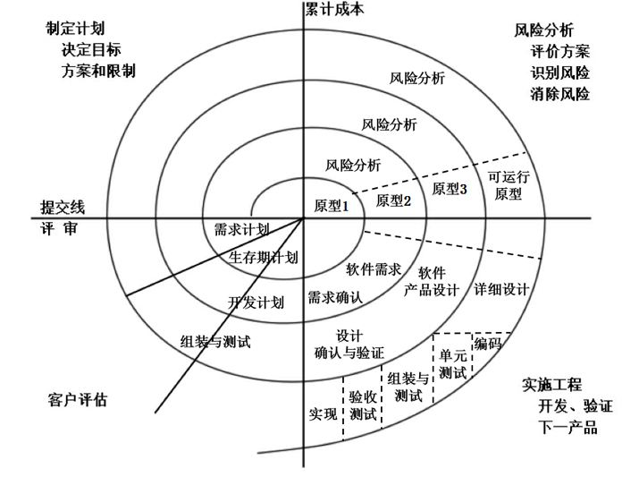
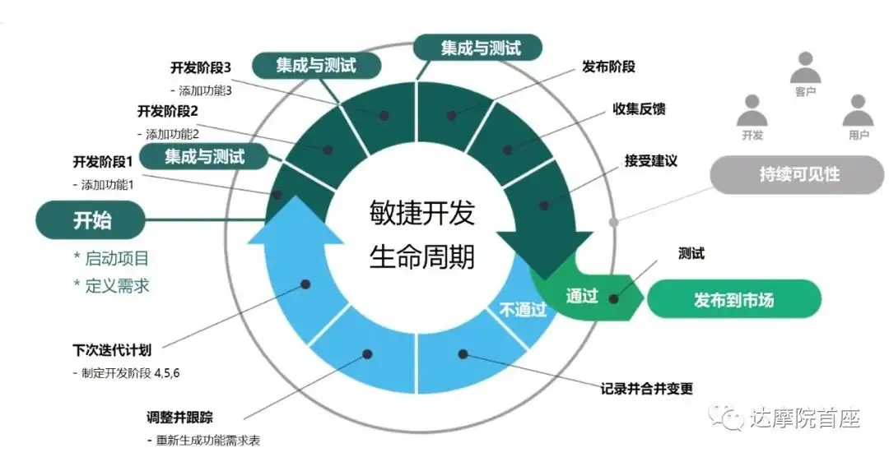
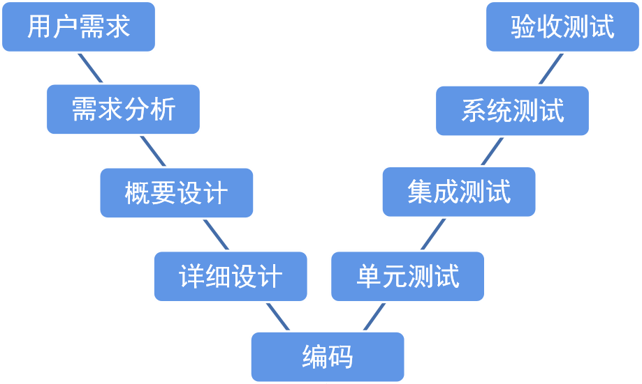
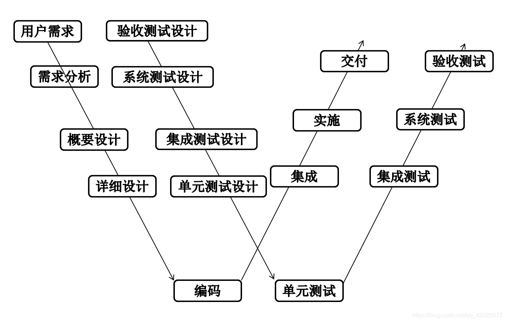

# 开发模型
### 瀑布模型

- 特点：阶段性强，每一个阶段比较独立，看重前期的需求分析和后期的测试。
- 缺点：测试在编码之后才介入，导致前期的问题后期才发现，会失去错误补救的机会

### 螺旋模型

- 特点：强调每一个迭代的测试质量和风险分析
- 缺点：风险管控的人力物力投入很多，成本比较大

### 敏捷模型

- 好处：
    - 通过结对编程产生编写良好的紧凑程序，与单独工作的程序员相比，该程序具有更少的错误。
它减少了整个项目的总开发时间。
    - 客户代表会在每次迭代后获得更新软件产品的想法。因此，如果需要，他很容易更改任何要求。
- 缺点：
    - 由于缺乏正式文件，这会造成混乱，不同阶段做出的重要决定可能会被不同的团队成员随时误解。
    - 由于缺乏适当的文档，当项目完成并且开发人员被分配到另一个项目时，开发项目的维护可能会成为一个问题。

# 测试模型
### V模型

- 特点：每一个阶段独立性强，左边每一个阶段是右边测试阶段的依据
- 缺点：V模型是瀑布模型变种，编码后才可以进行测试，前期的错误后期才会发现，会失去错误纠正的机会

### W模型

- 特点：每一个阶段独立性强，测试一开始就介入，可以保证前期的问题及时发现并进行纠正，测试和开发并行的
- 缺点：每一个阶段都是串行的过程，一个阶段完了之后再进行下一个阶段，不支持敏捷开发（拥抱变化） 