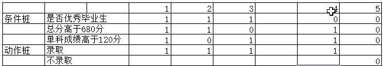

<style>
h1,h3{
    text-align:center
}
</style>

# 用例设计
## 白盒测试
1. 语句覆盖：选择足够多的测试用例，使得程序中的每个可执行语句至少执行一次。
2. 判定覆盖：通过执行足够的测试用例，使得程序中的每个判定至少都获得一次“真”值和“假”值。
   `使程序中的每个取“真”分支和取“假”分支至少均经历一次，也称为“分支覆盖”。`
3. 条件覆盖：设计足够多的测试用例，使得程序中每个判定包含的每个条件的可能取值（真/假）都至少满足一次。
4. 判定/条件覆盖：设计足够多的测试用例，使得程序中每个判定包含的每个条件的所有情况（真/假）至少出现一次，并且每个判定本身的判定结果（真/假）也至少出现一次。    
   `满足判定/条件覆盖的测试用例一定同时满足判定覆盖和条件覆盖。`
5. 组合覆盖：通过执行足够的测试用例，使得程序中每个判定的所有可能的条件取值组合都至少出现一次。    
   `满足组合覆盖的测试用例一定满足判定覆盖、条件覆盖和判定/条件覆盖。`
6. 路径覆盖：设计足够多的测试用例，要求覆盖程序中所有可能的路径。
## 黑盒测试
### 等价类
~~~
在集合中各个个体之间因外部输入引起的响应基本无差异，等价类是某个测试对象输入集合。
等价类便用情况:当一个集合中的任意输入引起的输出基本无差异时或者说在有输入的地方可以分类时，都可以考虑等价类。
1.有效等价类的目的是为了验证软件符合需求说明书上的功能，使用无效等价是为了考察软件对异常数据的处理能力。
2.有效等价类的目的是为了验证软件符合需求说明书上的功能，使用无效等价是为了考察软件对异常数据的处理能力.
~~~
1. 分类
    1. 有效等价类:有效的测试输入集合
    2. 无效等价类:无效的测试输入集合
2. 设计步骤：
    1. 为每一个有效等价类或无效等价类设计一个编号，有效等价类统一编号，无效等价类统一编号。
    2. 设计一个全新的测试用例，使其尽可能覆盖所有尚未覆盖的有效等价类，直至有效等价类完全覆盖，互斥条件单独覆盖
    3. 设计一个新的测试用例，使其仅覆盖一个无效等价类，直至覆盖全部无效等价类。
3. 等价类取值：最小值(自己，±1)，最大值(自己，±1)，中间值
4. 注意事项：
    1. 有效等价类，一条测试用例覆盖多个测试点
    2. 无效等价类，一条测试用例覆盖一个测试点
    3. 尽量简洁，无多余废话
    4. 正确：无错误描述
    5. 完整：包含所有必要信息
    6. 清晰：简单易理解
    7. 前后内容一致，衔接紧密
5. 等价类设计表
   | 测试项| 需求规格 | 有效等价类 | 编号|无效等价类|编号|
   | -- | -- | -- |-- |-- |-- |
   |&emsp;|   |   |  |  | |
   如：
   | 数据类型 | 有效等价类 |编号| 无效等价类 |编号|
   | -- | -- | -- |
|数据类型{rowspan=5}| 整数 |A01| 汉字 |B01| 
| 小数 |A02| 大小字母 |B02|
|      | |特殊字符|B03|
|      | |超长字符|B04|
|      | |空保存  |B04|
|输入域{rowspan=5}|有效等价类| |无效等价类| |
|(0-200]|A03|(-$\infty$，0)|B07|
|      |  |(200,+$\infty$)|B08|

### 边界值
~~~
边界值适用情况:需求说明书中规定了取值范围或者规定了值的个数。
~~~
1. 需要考虑的三个点
    1. 上点：输入域边界上的点
    2. 离点：离上点最近的一个点
    3. 内点：范围内的任意一个点
2. 基本步骤
    1. 为每一个等价类上点、离点、内点设定唯一编号。`上点内点统一编号，离点单独编号`
    2. 设计全新的测试用例，尽可能覆盖所有未覆盖的有效等价类，互斥单独覆盖。
    3. 设计全新的测试用例，单独覆盖所有未覆盖的无效等价类。
       | 测试项| 等价类名|上点|编号|离点|编号|内点|编号|
       | -- | -- | -- |--|
       |    | &emsp;|  |  | |  |  | | 
### 判定表
~~~
判定表是分析表达若干输入条件下，被测对象做出不同响应的工具。
1.存在多个输入条件，相互影响，产生不同效果。
~~~
1. 判定表结构
   |||
   |-|-|
   |条件桩{rowspan=2} |条件项1|
   |条件项2|
   |动作桩|动作项|
   - 条件桩：需求规格定义被测对象的所有输入
   - 条件项：针对条件桩可能输入的真假值
   - 动作桩：针对条件被测对象可能采取的所有操作
   - 动作项：针对动作桩，被测对象可能响应的所有操作
   - 规则：动作桩核条件项组合在一起(条件各种取值时，被测对象应该采取的动作)，可以针对每个合法输入组合的规则进行测试
   ==如：==
    
2. 设计步骤
    - 定义条件桩核动作桩
    - 设计优化判定表
    - 填写条件项、动作项    
       `用True，false填写`
    - 简化判断表
      - 输出相同的，输入相似的，在若干输入项(条件数较大)中仅有一项输出取任何值对输出均无影响
      - 条件基本相同，动作完全相同
      - 删除完全不可能的情况
    - 抽取用例 
### 正交实验法
<a>&emsp;&emsp;根据实验数据的正交性从全面的数据中选择部分具有代表性的数
据进行实现。</a>

1. 使用条件：多因子多水平条件下，因子的水平的情况。
2. 正交表特性
    1. 整齐可比：每个正交表的每个水平出现的次数完全相同
    2. 均匀分散：任意两列(两个因子)的水平搭配(横向形成的数字对)是完全相同的
3. 测试用例条数计算：$n=k \times{(m-1)}+1$(n表示实验次数，k因子数，m水平数)
4. 正交实验的实验方法
    - 分析需求获取因子和水平
    - 根据因子及水平数选择正交表
    - 替换因子水平，获得实验次数
    - 根据经验补充数据
### 状态迁移
<a>&emsp;&emsp;仅仅关注被测对象的状态变化，在需求规格说明书中是否有不可达
的状态和非法状态，
是否产生非法的状态迁移</a>

1. 状态：被测对象在特定输入条件下所保存的响应形势
2. 设计步骤
    - 明确状态节点
    - 绘制迁移图
      &emsp;&emsp;利用圆圈表示状态，箭头表示状态迁移关系，根据需要在状态标识迁移条件。图例如下：
     
     ```mermaid
     graph LR
     A((预订))-->|打电话订票|C((已支付))-->D((已票出))-->E((已使用))
     A--> B((已取消))
     C -->B
     D -->B
     ```
    - 绘制状态迁移树
      利用广度优先即深度优先法则绘制迁移树。
      - 确定起始节点及终止节点
      - 路径遇到终止节点时，不再扩展
     ```mermaid
     graph LR
     A((预订))-->B((已支付))-->C((已出票))-->D((已使用))
     A-->E((已取消))
     B-->F((已取消)) 
     C-->G((已取消)) 
     ```
    - 抽取测试路径测试用例
      &emsp;&emsp;根据迁移树抽取测试路径，从左到右横向抽取，每一条测试路径构成一条测试规则。
### 场景设计法
<a>&emsp;&emsp;现在软件几乎都是用事件触发来控制流程的，
事件触发时的情景，而同一事件触发顺序和处理结果形成结果流。</a>

1. 场景业务分类
    1. 基本流：经过每一个正确的流程运转到达预期结果。
    2. 备选流：经过每一个流程运转时可能产生异常情况，纠正后但最终能达到预期结果。
    3. 异常流：经过每一个流程运转时，产生异常终止。
2. 操作步骤
    1. 清楚被测对象的需求规格说明
    2. 根据需求流程描述抽取业务流程，绘制场景图
    3. 根据每个节点的需求，利用等价类及边界值方法细化路径
    4. 抽取测试路径

### 错误推断法
<a>&emsp;&emsp;根据经验进行测试</a> 
