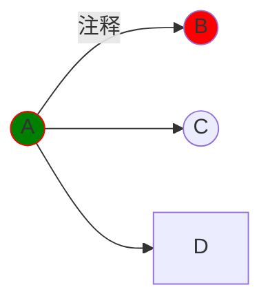
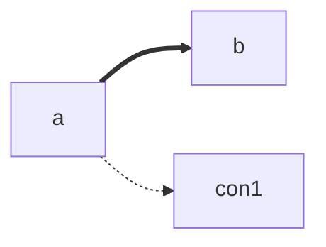

<style>
h1,h3{
    text-align:center
}
</style>

# 教程
latex公式：$k(x)=\int^{123}_{abc}f(x)dx$
### 思维导图


```text
1.可以预先声明，如A((A));B((B));
2.每行一个操作，多个操作用英文分号隔开
3.fill 填充色，stroke 外壳
```

### 直接引用HTML代码1
<a>aa</a>   

```text
1.<br>是HTML换行
2.&nbsp;&emsp;都是空格
3.如果显示异常，尝试在中间加个空格
```
<br>

### 直接引用HTML代码2
```html
<!-- --applet-- -->
<p>aa</p>
```
### 思维导图
+ root{.mindmap}
    + root1
        + root2
        + root4
        + root5
            + root6
            + root7
    + root3